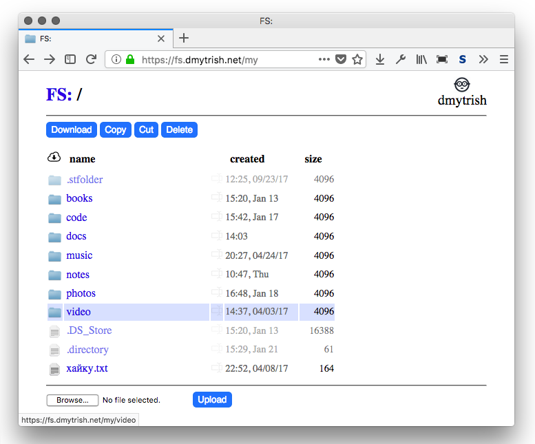

# FileShelf

FileShelf is a simple web-based file manager:



## Features

- fast directory browsing using lightweight pages;
- core functionality works without JavaScript, progressive enhancement; noscript/w3m/elinks compatible;
- file uploading/downloading;
- creating new files/directories, rename/delete, copy/cut/paste files;

File content plugins out of the box:
- viewing *pdf* files using your browser;
- editing text files using [CodeMirror](https://codemirror.net/) (with vim mode);
- reading *epub* files using [epub.js](https://github.com/futurepress/epub.js);
- playing html5-compatible audio files from a directory;
- playing html5-compatible video files (`mp4`/`ogv`; not `avi`, unfortunately);

FileShelf is *extensible*: write any file plugin you like!

Optional features:
- offloading large static files to Nginx;
- multiuser setup;
- basic HTTP authentication;


## Install and run

You must have `python > 3.3` installed; `virtualenv` is recommended, but you can install 
the packages from `requirements.txt` manually system-wide.

Clone/download the [Github repository](https://github.com/EarlGray/FileShelf).

To serve a directory (`./storage` by default) in a single-user mode, run:
```sh
$ /path/to/fileshelf/fileshelf.sh $DIRECTORY
```

Now check [http://localhost:8021](http://localhost:8021).

## Docker

If you want to use a Docker container, there is [the official FileShelf image at Dockerhub](https://hub.docker.com/r/dmytrish/fileshelf/):
```sh
$ docker pull dmytrish/fileshelf
```

Alternatively, you can build it yourself:

```sh
$ cd /path/to/fileshelf
$ docker build -t fileshelf:master .
```

To deploy the image, use the supplied [docker-compose.yml](docker-compose.yml)):
```sh
$ docker-compose up
```

and check [http://localhost:8021](http://localhost:8021)

## Configuration

FileShelf can take a configuration file as a parameter:

```
$ ./fileshelf.sh -c conf.json
```

Some values in the configuration file may be overriden from command line:
```
$ ./fileshelf.sh --port=8021 --debug
```

Configuration options are listed here: [fileshelf/config.py](https://github.com/EarlGray/fileshelf/blob/master/fileshelf/config.py#L5)

An example of a simple configuration file:

```json
{
    "host": "0.0.0.0",
    "port": 8021,
    "debug": true,
    "storage_dir": "~/fileshelf"
}
```
